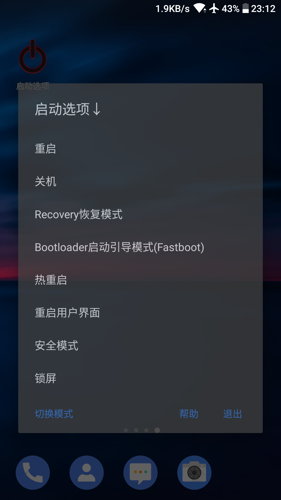
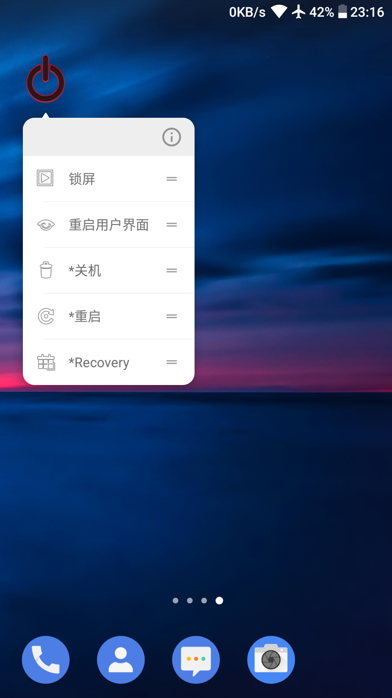

# 启动选项

## 概要
本**Android**应用程序是一个**简体中文**的电源菜单**应用**。

使用本应用可以降低使用电源键的频率从而延长其寿命。
## 特性
- 功能丰富：root模式下有两套电源选项，非root模式下有调用系统菜单的功能。
- 界面美观：使用半透明的Android系统组件Dialog构建而成。
- 入口快捷：支持App Shortcut，在Android限制以内可以长按启动器图标弹出菜单和创建单功能快捷方式。
## 界面截图
### 截图环境
- 机型：诺基亚7
- Android版本：8.0.0
- 系统版本：00CN_1_34C

(实际视觉效果可能随环境差异与图例不同)

## 下载
请到本仓库的[发布页面](https://github.com/ryuunoakaihitomi/rebootmenu/releases)下载本应用的官方发布版编译版本。~~已经会熟练找releases页面的请无视。~~
## License
基于[MIT协议](./LICENSE)发布。